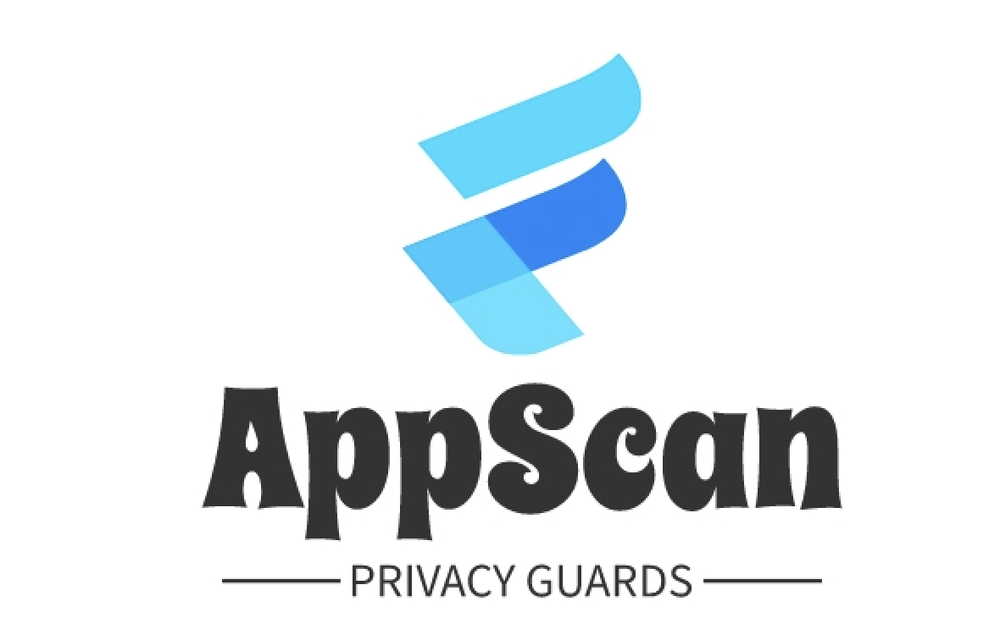
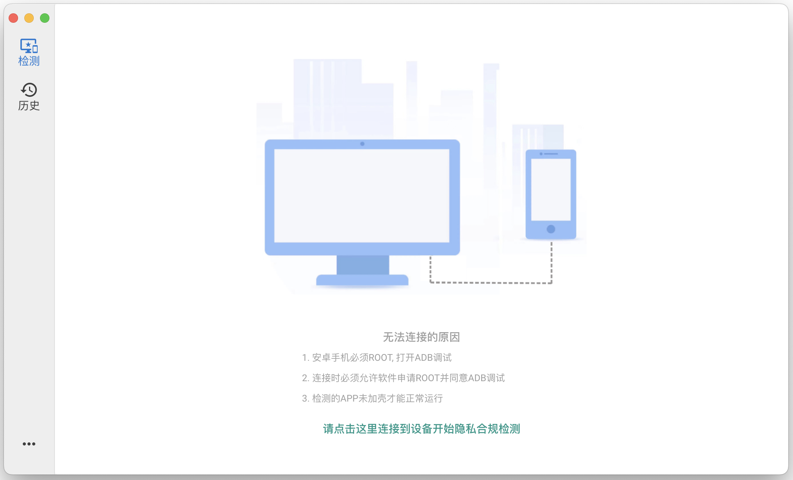

<h1 align="center">
  
</h1>

---

<h4 align="center">安全隐私卫士（AppScan）一款免费的企业级自动化隐私检测工具。</h4>

## 背景

&emsp;&emsp;随着移动互联网的高速发展，各公司对保护用户的个人隐私安全意识也在愈发重视。但是在实际业务场景中受限于代码开发质量或因产品设计不谨慎等原因，APP难免会引入一些违规收集的合规问题，因此各公司也在加大人力进行合规风险检测，不过随着业务不断发展、功能的频繁迭代更新，导致人工检测成本突增并且很多功能无法检测覆盖，基于以上背景，我们自研了AppScan这款隐私合规检测工具，它是一款基于动态分析，可以精准定位APP的违规风险点的自动化隐私检测工具，能够大大提高了合规检测的效率。

&emsp;&emsp;AppScan作为一款免费工具，可以帮助大家便捷、高效、全面的完成合规检测，但是由于AppScan还是一个刚孵化的产品，在自动化等方面还没有很完善，我们希望可以吸取大家在使用过程中发现的问题以及优化的建议，帮助AppScan一起成长。

## AppScan优点

+ 全面性: &ensp;从信息收集、权限申请及数据传输等多个维度，实现对APP个人信息合规的全面检测。
+ 规范性: &ensp;全面覆盖《App违法违规收集使用个人信息行为认定方法》、国家标准GB/T35273《信息安全技术 个人信息安全规范》、《中华人民共和国网络安全法》等主流安全检测标准。
+ 高效性: &ensp;可帮助APP开发公司及开发者快速对APP进行日常合规检测，深度挖掘隐私合规风险点、快速处理大批量App，替代人工翻查代码，降低时间与人力成本，显著提升检测效率。
+ 易用性: &ensp;无需环境搭配、开箱即用。

> 温馨提示：AppScan代码将在后续开源。点个star，敬请期待🌟🌟🌟

## 安装指南

⬇️[下载地址](https://github.com/tongcheng-security-team/AppScan/releases)

## 使用文档

🏠[使用文档](https://appscan.ly.com)

## 系统展示

* 连接展示

* 结果展示

## 联系我们
<figure>
  <figcaption>加管理微信，拉你进群交流</figcaption>
  
  <figcaption>同程安全应急响应中心-公众号</figcaption>
  
</figure>

## 特别致谢

> 开发过程中参考了以下项目的部分代码，特别在此致谢

* https://github.com/zhengjim/camille
* https://github.com/quasarframework/quasar

