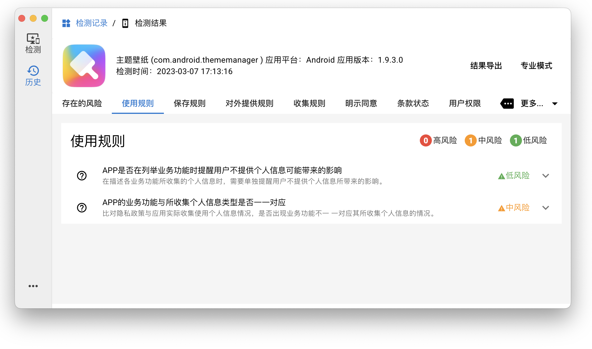

<h1 align="center">
  
</h1>

---

<h4 align="center">安全隐私卫士（AppScan）一款免费的企业级自动化隐私检测工具。</h4>

## 背景
&emsp;&emsp;随着移动互联网的高速发展, 各公司对保护用户的个人隐私安
全意识也在愈发重视. 但是在实际业务场景中受限于代码开发
质量或因产品设计不谨慎等原因, APP 难免会引入一些违规收集
的合规问题, 因此各公司也在加大人力进行合规风险检测, 不过
随着业务不断发展、功能的频繁迭代更新, 导致人工检测成本
突增并且很多功能无法检测覆盖, 基于以上背景, 我们开发了
AppScan 这款隐私合规检测工具, 它是一款基于动态分析, 可以
精准定位 APP 的违规风险点的自动化隐私检测工具, 能够大大
提高了合规检测的效率, 帮助使用者便捷、高效、全面的完成
合规检测, 保障业务合规运行.

&emsp;&emsp;AppScan作为一款免费工具，可以帮助大家便捷、高效、全面的完成合规检测，但是由于AppScan还是一个刚孵化的产品，在自动化等方面还没有很完善，我们希望可以吸取大家在使用过程中发现的问题以及优化的建议，帮助AppScan一起成长。

## AppScan优点
+ 全面性: &ensp;从信息收集、权限申请及数据传输等多个维度，实现对APP个人信息合规的全面检测。
+ 规范性: &ensp;全面覆盖《App违法违规收集使用个人信息行为认定方法》、国家标准GB/T35273《信息安全技术 个人信息安全规范》、《中华人民共和国网络安全法》等主流安全检测标准。
+ 高效性: &ensp;可帮助APP开发公司及开发者快速对APP进行日常合规检测，深度挖掘隐私合规风险点、快速处理大批量App，替代人工翻查代码，降低时间与人力成本，显著提升检测效率。
+ 易用性: &ensp;无需环境搭配、开箱即用。

## 关于暂时停止发布MacOs官方安装包的公告
https://github.com/TongchengOpenSource/AppScan/discussions/51

## 安装指南
⬇️[下载地址](https://github.com/tongcheng-security-team/AppScan/releases)

## 支持的环境
- windows: 10及以上
- macOs: 11.0及以上
- android: 8.x及以上
- app: 64位/未加固(有时候引入的第三方sdk也会自带一些反检测功能)

## 模拟器
根据 https://github.com/TongchengOpenSource/AppScan/discussions/29 的投票结果, 我们对MuMu和雷电进行了适配工作
目前模拟器支持未完全上线, 用户可在 release 中下载pre版本进行测试
目前支持的模拟器
- 雷电模拟器9(需要在 设置-其他设置 中开启root权限, 设置ADB调试为'开启本地连接')

目前暂不支持的模拟器
- MuMu模拟器12(通过remote adb链接, 功能正在开发中)

## 使用文档
> 使用者查看此文档即可

希望您可以提交公司/组织信息, 帮助AppScan更好的成长, 谢谢

🏠[使用文档](https://github.com/TongchengOpenSource/AppScan/wiki)

## 开发文档
> 开发者需要额外查看文档

AppScan持续吸纳开发者加入, 一起完善AppScan, 为开源做贡献
https://github.com/TongchengOpenSource/AppScan/discussions/52

### 架构
👽[架构说明](./doc/architecture.md)

### 开发文档
👽[开发文档](./doc/dev.md)

### build指南
👽[build指南](./doc/build.md)

### api文档
👽[api文档](./doc/api.md)

## 系统展示
* 连接展示

* 结果展示

## 联系我们
<figure>
  <figcaption>加管理微信，拉你进群交流</figcaption>
  
  <figcaption>同程安全应急响应中心-公众号</figcaption>
  
</figure>

## 特别致谢
> 开发过程中参考了以下项目的部分代码和思路，特别在此致谢
- https://github.com/zhengjim/camille
- https://github.com/r0ysue/r0capture
- https://github.com/hzzheyang/strongR-frida-android

> appScan的功能更新需要适配流行的安卓版本, 开发者的机器有限, 感谢社区伙伴们的帮助, 提供了更多的安卓版本与机型进行测试,  同时积极的反馈问题.    
> 这里列举了部分积极帮助我们进行测试的人员名单(微信id). 感谢伙伴们的付出, 帮助appScan成长
- wenxuanxiaomu
- FW5215118
- mOan1215
- wxid_yrhfgzsdjoj422

## 404星链计划

AppScan 现已加入 [404星链计划](https://github.com/knownsec/404StarLink)
