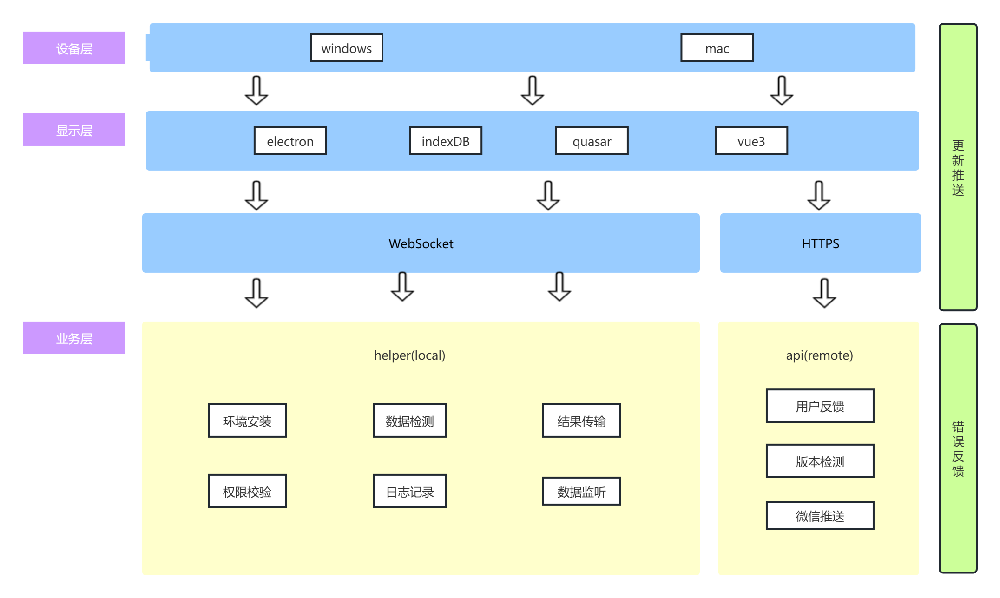

# 架构文档

## 架构图


## 项目结构
``` bash
$ tree -L 1
.
├── doc
├── helper
├── README.md
└── view

3 directories, 1 file
```

### helper
控制端    
由python编写, 用于与手机进行交互, 通过adb/frida-server与手机进行交互, 通过websocket与view端进行交互

### view
展示页面   
由vue3编写, 用于与用户进行交互, 通过websocket与helper端进行交互